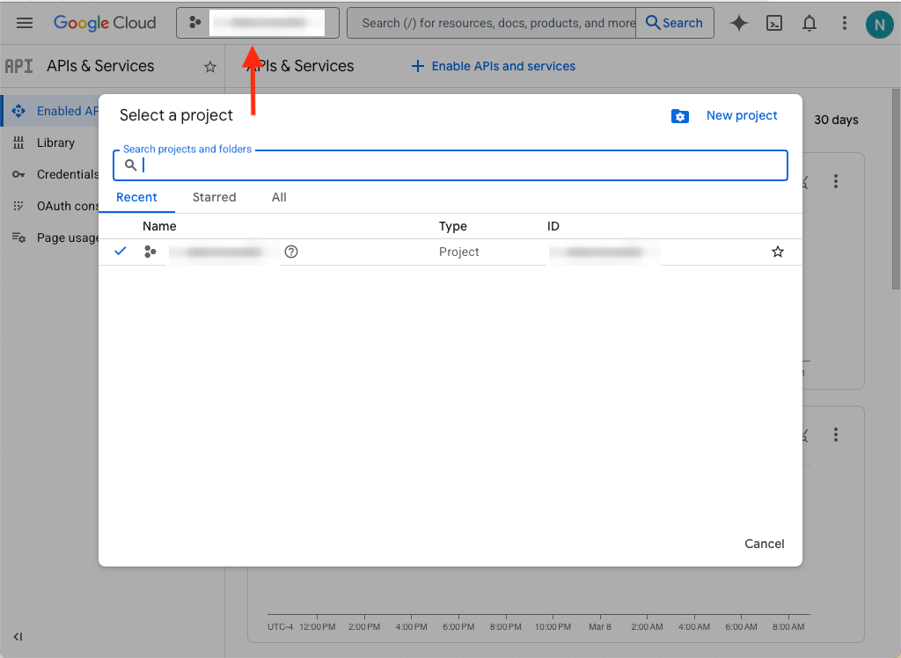

# Google Authentication Setup

## Summary

1. Create a **Project** (unless adding the application to an existing project)
2. Create an **OAuth Consent Screen**
3. Create a **Client**
4. Specify **Data Access** (i.e. scopes)

## Steps

Visit https://console.developers.google.com/

Access **API & Services Dashboard**:

Create a **Project**. Take note if you would like to change the Project ID this cannot be changed later.

Or if a project already exists, select "Create project" in the project drop-down menu:

Confirmation screen, ensure the new project is current in the project drop-down menu:

Navigate to the **OAuth Consent Screen**:

Create a **Client**:

If you haven't configured the **OAuth Consent screen**, you'll see this:

- Don't need Authorized JavaScript origins unless doing some sort of Javascript application
- Use http://localhost:4000/auth/google/callback to test locally

Copy the Client ID and Client Secret for the application:

Configure the environgment with the credentials for `.env`, see `.env.template` to get started.

Specify scopes under **Data Access**:

