# Google Authentication Setup

## Summary

1. Create a **Project** (unless adding the application to an existing project)
2. Create an **OAuth Consent Screen**
3. Complete **Branding** (required?)
4. Create a **Client**
5. Specify **Data Access** (i.e. scopes)

## Steps

Visit https://console.developers.google.com/

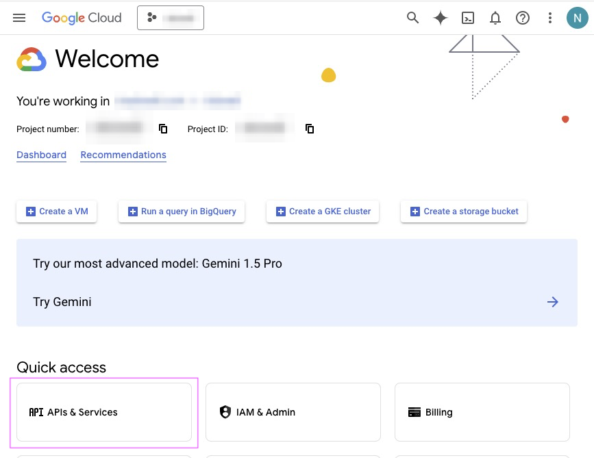

Access **API & Services Dashboard**:

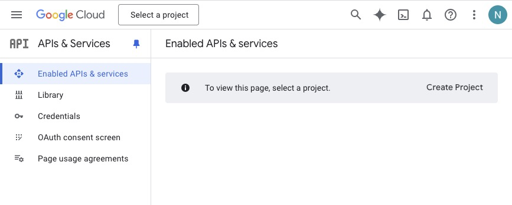

Create a **Project**. Take note if you would like to change the Project ID this cannot be changed later.

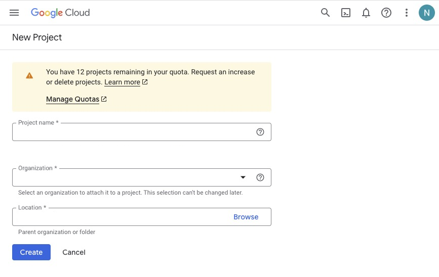

Confirmation screen:

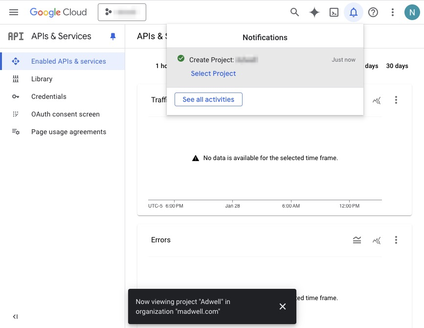

Navigate to the **OAuth Consent Screen**:

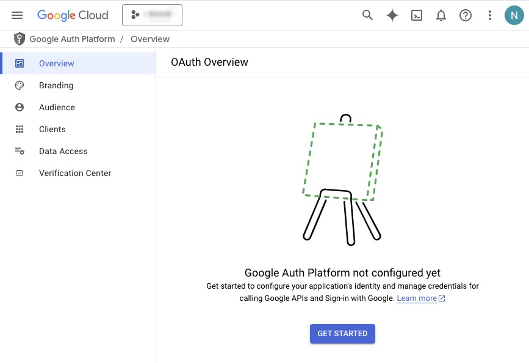

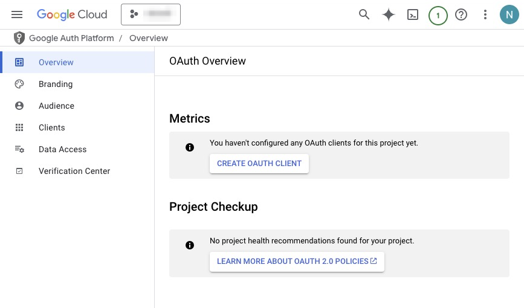

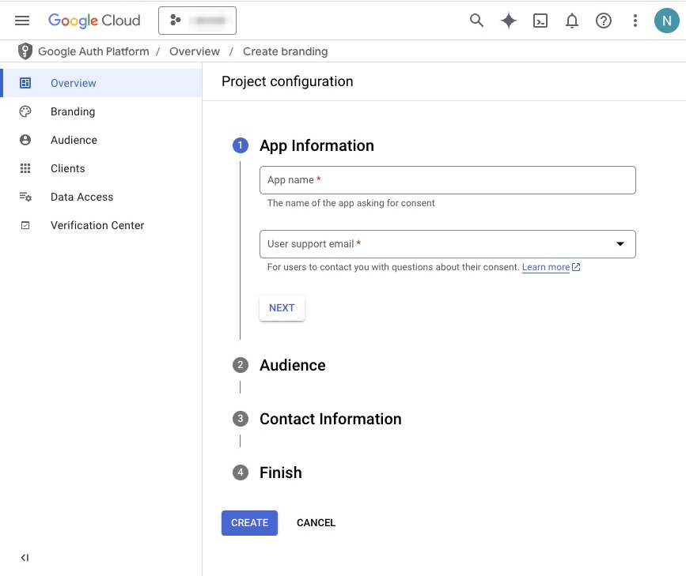

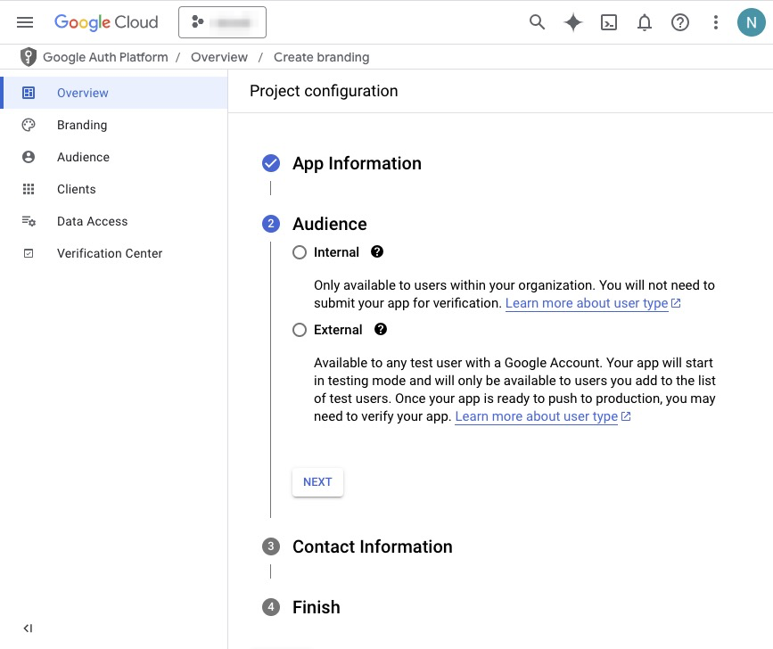

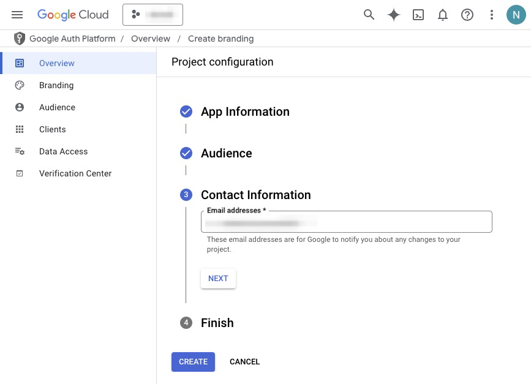

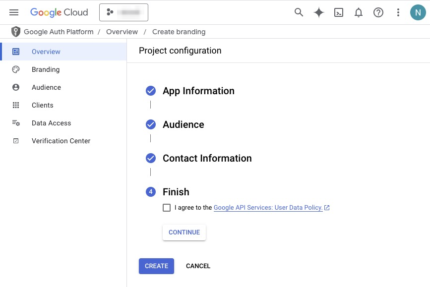

Complete **Branding** (I don't think this is required):

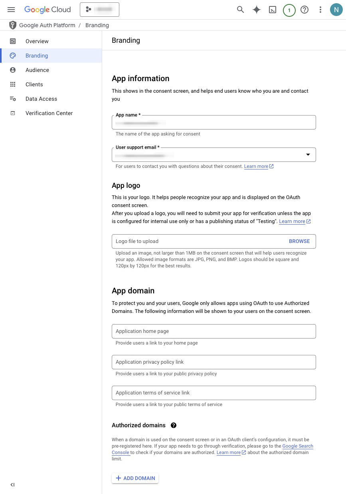

Create a **Client**:

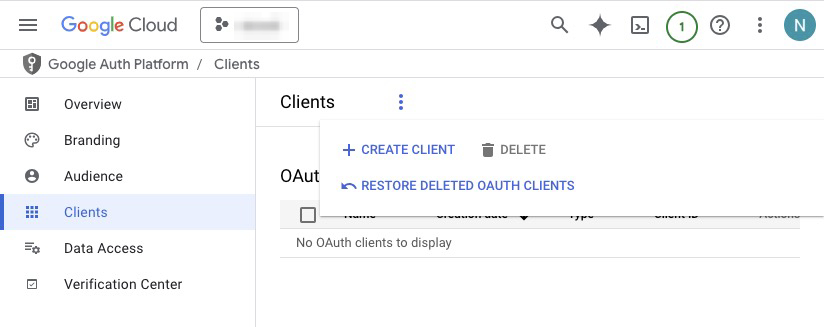

If you haven't configured the **OAuth Consent screen**, you'll see this:

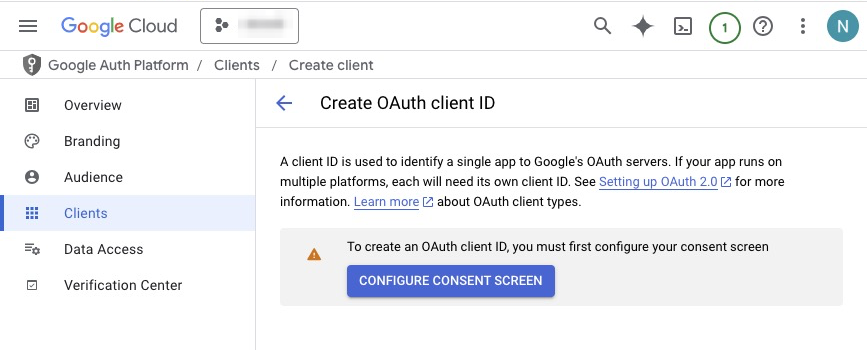

- Don't need Authorized JavaScript origins unless doing some sort of Javascript application
- Use http://localhost:4000/auth/google/callback to test locally

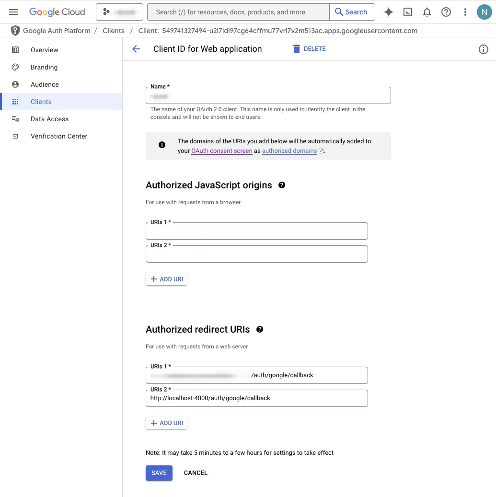

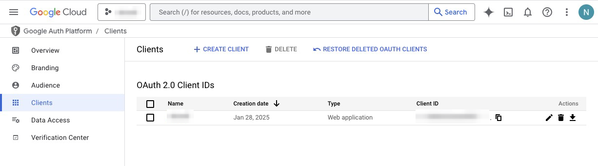

Copy the Client ID and Client Secret for the application:

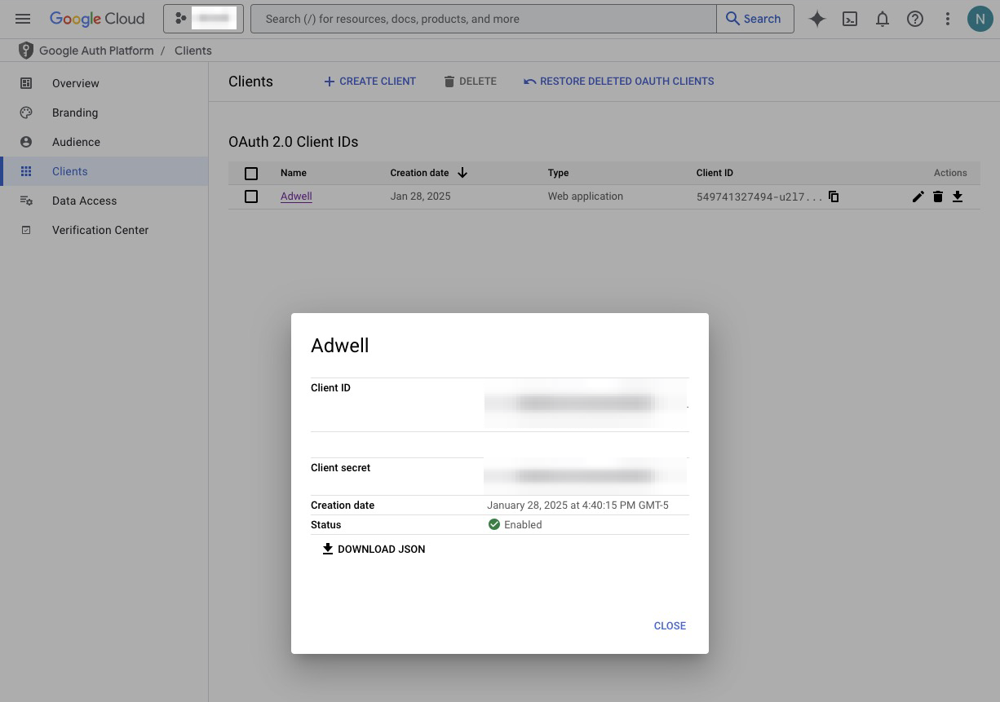

Specify scopes under **Data Access**:

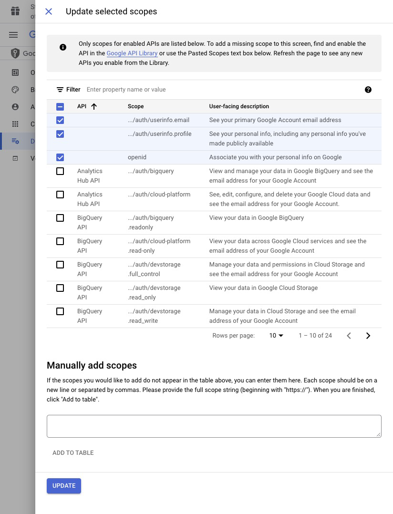

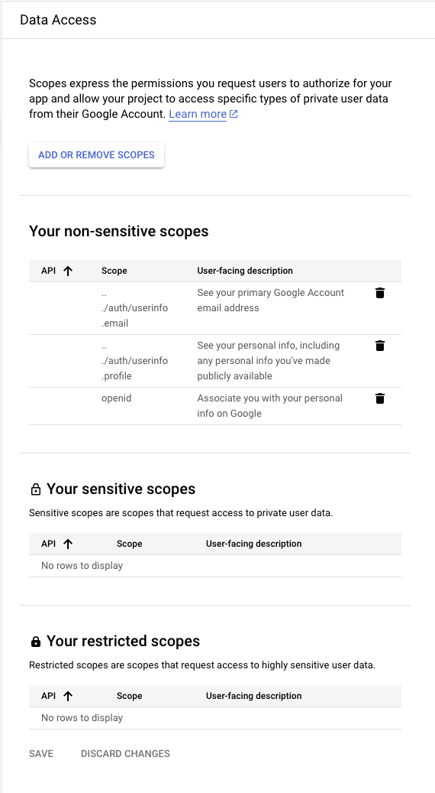

